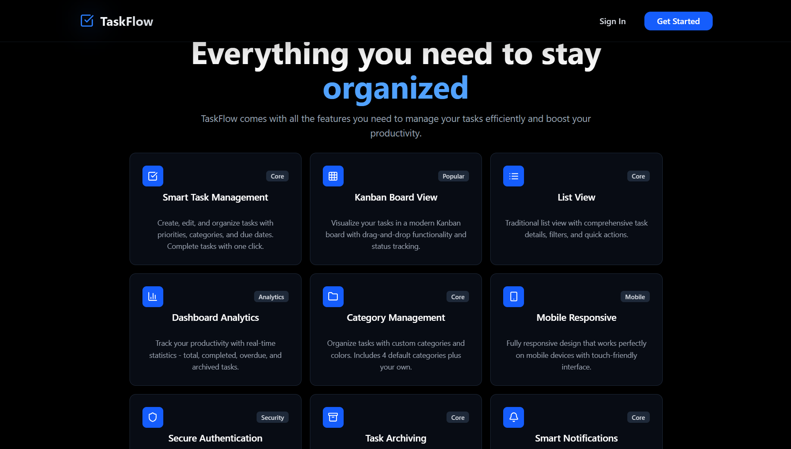

# 🚀 TaskFlow — Modern Task Management App


> A beautiful, full-stack task management application built with the MERN stack — forked and maintained by [@rohitshivhare21](https://github.com/rohitshivhare21)

🌐 **Live Demo**: [taskflow-sagar.vercel.app](https://taskflow-sagar.vercel.app/)

---

## 📖 About the Project

**TaskFlow** is a modern, free, open-source task management application designed for individuals and teams. It offers an intuitive interface for managing tasks, setting priorities, organizing categories, and tracking deadlines — all in one place.

This is a forked version of the original TaskFlow project, explored and maintained for learning full-stack MERN development and portfolio purposes.

---

## ✨ Features

- 📝 **Smart Task Creation** — Add tasks with title, description, priority & category
- 🎯 **Priority Management** — High, Medium, Low priority with visual indicators
- 🗂️ **Category Organization** — Custom categories with color coding
- 📅 **Due Date Tracking** — Set deadlines and never miss them
- 🔄 **Task Status Flow** — Todo → In Progress → Completed
- 🌙 **Dark Theme UI** — Eye-friendly dark interface with blue accents
- 📱 **Fully Responsive** — Works on desktop, tablet, and mobile
- 🔒 **JWT Authentication** — Secure login and signup
- ⚡ **Real-time Updates** — Instant UI changes without page refresh
- 🎨 **Smooth Animations** — Polished interactions with Framer Motion

---

## 🧰 Tech Stack

| Layer | Technology |
|-------|-----------|
| Frontend | React 18, Vite, Tailwind CSS |
| Animations | Framer Motion |
| UI Components | Radix UI, shadcn/ui, Lucide Icons |
| Backend | Node.js, Express.js |
| Database | MongoDB, Mongoose |
| Auth | JWT, bcryptjs |
| Deployment | Vercel (Frontend), Render (Backend) |

---

## 🚀 Getting Started

### Prerequisites

- Node.js v16+
- MongoDB (local or [Atlas](https://www.mongodb.com/atlas))
- npm or yarn

### Installation

```bash
# 1. Clone the repository
git clone https://github.com/rohitshivhare21/taskflow.git
cd taskflow

# 2. Install root dependencies
npm install

# 3. Install client dependencies
cd client && npm install

# 4. Install server dependencies
cd ../server && npm install && cd ..
```

### Environment Setup

**client/.env**
```env
VITE_API_URL=http://localhost:3000/api
VITE_APP_NAME=TaskFlow
```

**server/.env**
```env
PORT=3000
MONGODB_URI=mongodb://localhost:27017/taskflow
JWT_SECRET=your-secret-key-here
JWT_EXPIRES_IN=7d
CLIENT_URL=http://localhost:5173
```

### Run the App

```bash
# Start both frontend and backend together
npm run dev
```

| Service | URL |
|---------|-----|
| Frontend | http://localhost:5173 |
| Backend API | http://localhost:3000 |

---

## 📁 Project Structure

```
taskflow/
├── client/                  # React Frontend
│   ├── src/
│   │   ├── components/      # Reusable UI components
│   │   │   ├── landing/     # Landing page sections
│   │   │   ├── layout/      # Navbar, Footer
│   │   │   └── ui/          # Buttons, Cards, Inputs
│   │   ├── pages/           # Route pages (Dashboard, Login, Signup)
│   │   ├── lib/             # Utilities & API config
│   │   └── App.jsx
│   ├── tailwind.config.js
│   └── vite.config.js
│
├── server/                  # Node.js Backend
│   ├── src/
│   │   ├── controllers/     # Auth & Todo logic
│   │   ├── middleware/      # JWT auth middleware
│   │   ├── models/          # User, Todo, Category schemas
│   │   ├── routes/          # API routes
│   │   └── db/              # MongoDB connection
│   └── index.js
│
├── screenshots/             # App screenshots
└── package.json             # Root package (concurrent dev)
```

---

## 📱 API Reference

### Auth Routes
```
POST /api/auth/register   → Register new user
POST /api/auth/login      → Login user
```

### Task Routes
```
GET    /api/todos         → Get all tasks
POST   /api/todos         → Create new task
PUT    /api/todos/:id     → Update task
DELETE /api/todos/:id     → Delete task
```

### Category Routes
```
GET    /api/categories    → Get all categories
POST   /api/categories    → Create category
DELETE /api/categories/:id → Delete category
```

---

## 🎨 Screenshots

### 🏠 Home Page


### ✨ Features


### 🔐 Sign In


### 💻 MacBook UI Demo


---

## 👤 Fork Maintainer

**Rohit Shivhare**
- GitHub: [@rohitshivhare21](https://github.com/rohitshivhare21)

> ⭐ If you like this project, don't forget to give it a star!
